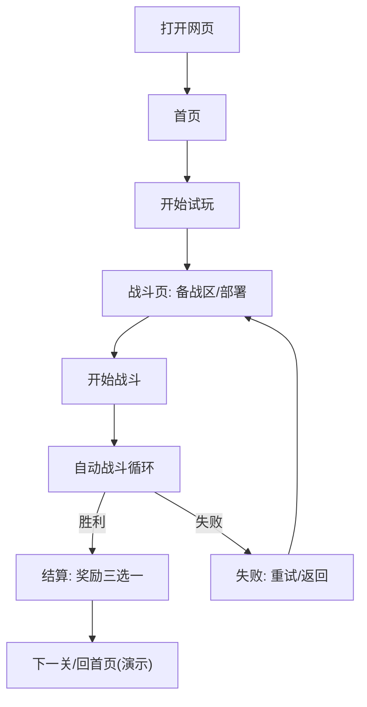

## 1. 产品概述
将 Godot 项目《时空阵线》的核心玩法（编队部署 + 自动战斗 + 战后奖励 + 局内商店/成长）移植为可在浏览器直接试玩的 Web Demo，并在 Web 端以更现代的 UI 重新呈现。
- 目标用户：想快速试玩/验证玩法与节奏的玩家；需要迭代机制与 UI 的策划/开发。
- 产品价值：无需安装即可体验核心循环，便于快速迭代与分享链接收集反馈。

## 2. 核心功能

### 2.1 功能模块（Web Demo 范围）
1. **首页（主菜单）**：开始试玩、（可选）存档管理入口、玩法说明入口
2. **战斗页**：备战区卡牌、拖拽部署到网格、开始战斗、倍速、战斗日志、胜负结算
3. **图鉴页（轻量）**：查看已拥有单位卡牌、标签/词条说明（用于验证 CardSlot 体系）

### 2.2 页面明细
| 页面名称 | 模块名称 | 功能描述 |
|---|---|---|
| 首页 | 开始试玩 | 一键进入战斗页，自动加载默认“试玩存档” |
| 首页 | 存档管理（Demo） | 可选：选择槽位、清档、读取；基于 localStorage |
| 首页 | 玩法说明 | 简要说明：民力、部署、冷却、奖励、商店（可用抽屉/弹窗） |
| 战斗页 | 备战区 | 显示卡牌列表（堆叠数量），支持拖拽出牌 |
| 战斗页 | 部署网格 | 6×6（可配置），支持单位形状占格、碰撞判定、撤回 |
| 战斗页 | HUD 状态 | 我方/敌方民力、羁绊摘要（MVP 可选）、倍速、日志开关 |
| 战斗页 | 战斗循环 | Cooldown→Ready→Action；产出单位增加民力；攻击单位消耗民力并造成伤害 |
| 战斗页 | 结算与奖励 | 胜利：奖励三选一（单位/金币/升级），失败：重试/返回 |
| 图鉴页 | 卡牌列表 | 展示单位卡牌、稀有度、文明/兵种、标签说明 |
| 图鉴页 | 详情面板 | 展示属性、背景故事、标签描述 |

## 3. 核心流程

### 3.1 主流程（试玩）
用户打开网页 → 点击“开始试玩” → 进入战斗页 → 从备战区拖拽部署 → 点击“开始战斗” → 自动战斗 → 胜利结算 → 选择奖励 → 进入下一关/回首页（Demo 可仅 1 关循环）

### 3.2 存档流程（Demo）
首页选择槽位 → 读取/新开 → 保存（可选）→ 战斗页自动读写“当前试玩存档”

## 4. 用户界面设计

### 4.1 设计风格（建议方向）
- 整体：暗色战术桌面 + 金色强调色，强调“编队/战线/卡牌”的质感
- 排版：强层级（HUD 顶部状态、中央战场、底部备战区），信息密度可控
- 卡牌：统一 CardSlot 视觉体系（稀有度徽章、文明纹理条、关键属性图标）
- 动效：部署吸附、冷却进度条、伤害飘字、胜利结算弹层的渐入与交错
- 字体：标题使用具气质的衬线/展示字体，正文使用清晰的无衬线（实现时选用 Web 安全可用的字体组合或开源字体）

### 4.2 响应式策略
- 桌面优先（1920×1080 设计基准）
- 兼容宽屏与 1366×768：战场居中缩放，备战区可横向滚动
- 移动端：Demo 阶段可降级（仅适配查看，不强制支持拖拽）

## 5. 数据与内容范围（MVP）
- 单位：至少 8 张（产出/消耗/射程/防御/标签若干）
- 标签：至少 4 个（冲锋、狙击、医者、亡语/牺牲任选）
- 关卡：至少 1 关（敌军固定编队 + 敌方民力/生命池）
- 奖励：三选一（新增单位/金币/扩充战线行或列）

## 6. 验收标准（可试玩）
- 用户可在浏览器完成：部署→开战→胜负→领取奖励→继续/重试
- 关键数值与表现稳定：民力变化、冷却循环、占格判定、胜负判定
- UI 不出现“原型凑合感”：卡牌/HUD/结算弹层具统一风格

