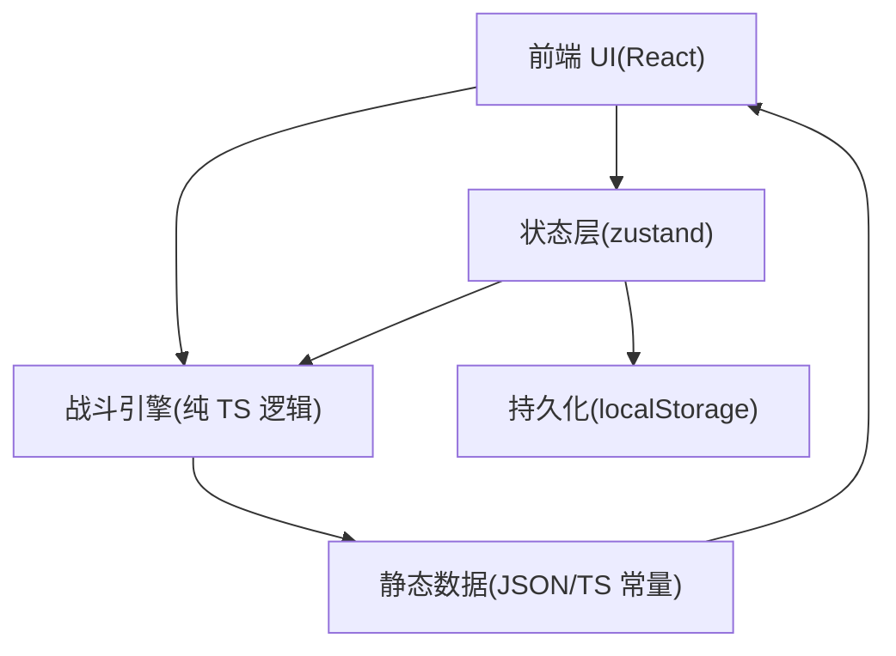

## 1. 架构设计

本 Web 移植为纯前端应用（无后端），在浏览器内完成战斗模拟与存档持久化（localStorage）。

## 2. 技术选型说明
- 前端：React@18 + TypeScript + Vite
- 样式：TailwindCSS（配合 CSS 变量做主题 token）
- 状态管理：zustand
- 路由：react-router-dom
- 测试：Vitest（核心战斗引擎单测 + 关键组件渲染测试）
- 数据：本地静态数据（后续可由 Godot `.tres` 转换为 JSON 导入）
- 部署：本地 dev server 提供试玩入口（后续可一键部署到静态托管）

## 3. 路由定义
| Route | 用途 |
|---|---|
| / | 首页（开始试玩/存档入口/说明） |
| /battle | 战斗页（部署、开战、结算） |
| /barracks | 图鉴页（单位卡牌查看） |

## 4. 核心模块划分（建议目录）
- src/pages
  - Home.tsx：首页
  - Battle.tsx：战斗页（只做 UI 编排与交互转发）
  - Barracks.tsx：图鉴页
- src/components
  - CardSlot：卡牌 UI（复用）
  - GridBoard：部署网格（渲染 + 交互）
  - HudBar：顶部 HUD
  - ResultModal：结算与奖励
  - Tooltip：标签/单位说明
- src/engine
  - battleEngine.ts：战斗循环调度（tick、倍速、胜负判定）
  - unitModel.ts：单位模型与状态（CD、HP、标签钩子）
  - tagSystem.ts：标签接口与实现（冲锋/狙击/医者/亡语等）
  - gridSystem.ts：占格判定与放置/撤回
- src/store
  - useGameStore.ts：全局状态（存档、单位库、当前关卡、战斗运行态）
- src/data
  - units.ts：单位数据（MVP 先写 TS 常量）
  - levels.ts：关卡数据
  - tags.ts：标签文本与配置
- src/utils
  - rng.ts：抽奖/权重工具
  - persist.ts：localStorage 读写

## 5. 数据模型（前端）

### 5.1 UnitData（对应 Godot 的 UnitData）
- id: string
- name: string
- rarity: "common" | "uncommon" | "rare" | "epic" | "legendary"
- civilization: string
- unitClass: string
- color: string
- tags: string[]
- gridShape: {x:number,y:number}[]
- maxHp: number
- manpowerCost: number
- cooldown: number
- attackDamage: number
- defense: number
- attackRange: number
- chargeCount: number
- story: string

### 5.2 LevelConfig（对应 Godot 的 LevelConfig）
- id: string
- name: string
- gridWidth/gridHeight: number
- formationCols/formationRows: number
- enemyPower: number
- enemyUnits: {unitId:string, gridPos:{x:number,y:number}}[]
- rewardPoolId: string

### 5.3 存档结构（localStorage）
- key: "save_slot_1" | "save_slot_2" | "save_slot_3" | "autosave"
- value:
  - progress: { levelIndex, rows, cols, runGold, runManpowerBonus }
  - library: { ownedUnitIds: string[], copies: Record<string, number> }
  - meta: { prestige, upgrades: Record<string, boolean> }（MVP 可选）

## 6. 关键技术决策
- 战斗引擎与 UI 解耦：UI 只派发“部署/开始/选择奖励”等事件；引擎输出可序列化的 BattleState
- Tick 模型：以 requestAnimationFrame 驱动时间累计（支持倍速），按单位 cooldown 触发 Action
- 标签系统：使用钩子接口模拟 Godot TagDefinition（onBattleStart/onAttackStart/modifyDamage/onPostAttack/onDeath/onAllyDied）
- 占格系统：用 Map<string, unitInstanceId> 存 occupancy；放置时验证形状与边界

