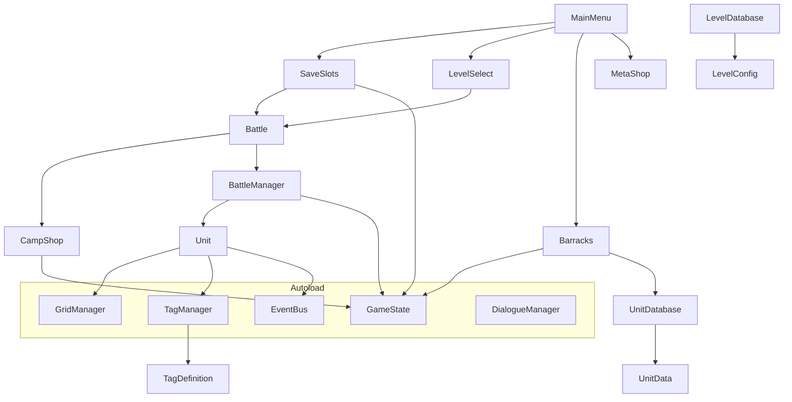

# 时空阵线（Godot 4.6）Code Wiki

本 Wiki 基于当前仓库代码与资源组织生成，面向“能继续开发/重构/移植”的阅读需求，覆盖整体架构、主要模块职责、关键类与函数、依赖关系与运行方式，并补充 Web 移植与 UI 重设计的映射建议。

## 目录

- 1. 项目概览
- 2. 仓库结构
- 3. 架构总览（场景流转 + 全局单例）
- 4. 关键运行流程（从主菜单到战斗/结算/营地）
- 5. 主要模块说明
  - 5.1 AutoLoad（全局单例）
  - 5.2 战斗系统（BattleManager / Unit / Grid / Tag）
  - 5.3 UI 与流程场景（MainMenu / SaveSlots / LevelSelect / Barracks / CampShop / MetaShop）
  - 5.4 数据资源（Unit/Level/Tag/Pool/Dialogue）
- 6. 依赖关系（代码与资源）
- 7. 项目运行与导出
- 8. Web 移植与 UI 重设计建议（对应现有模块映射）

---

## 1. 项目概览

- 引擎：Godot 4.6（见 [project.godot](file:///workspace/project.godot#L15-L19) 的 features）。
- 类型：2D 网格编队 + 自动战斗；以“民力/粮草（manpower）”为核心资源约束；战后奖励三选一 + 营地整备 + 关卡推进。
- 叙事：DialogueManager 插件驱动对话；战斗/选关可播放对应关卡 `.dialogue`。

---

## 2. 仓库结构

- Assets：图片资源（背景、卡牌 UI 纹理、按钮/面板等）。
- AutoLoad：全局单例（EventBus / GameState / TagManager）。
- Scenes：核心场景（MainMenu/Battle/CampShop/Barracks/LevelSelect/SaveSlots/LevelEditor 等）。
- Scripts：主逻辑脚本（BattleManager/Unit/GridManager/各 UI 场景脚本/Editor 等）。
- Resources：可导出/可配置数据资源（UnitData/LevelConfig/Tags/RewardPools/ShopPools/Relics/Database 等）。
- Dialogues：对话脚本（`.dialogue`）。
- addons：第三方插件（dialogue_manager、godot_state_charts、phantom_camera 等）。

---

## 3. 架构总览（场景流转 + 全局单例）

### 3.1 入口与场景流转

- 入口场景：`res://Scenes/MainMenu.tscn`（见 [project.godot](file:///workspace/project.godot#L15-L20)）。
- 典型用户路径：
  - MainMenu → SaveSlots（新开/读档）→ Battle
  - Battle（胜利）→ 奖励三选一 → 下一关（或通关回到 MainMenu）
  - Battle（失败）→ Retry / Menu
  - MainMenu → LevelSelect（选关+可能播放开场对话）→ Battle
  - MainMenu → Barracks / MetaShop / LevelEditor

### 3.2 全局单例（Autoload）

Autoload 列表见 [project.godot](file:///workspace/project.godot#L22-L29)：

- `GameState`：全局运行态 + 存档/经济/局外成长 + UI 样式入口（[GameState.gd](file:///workspace/AutoLoad/GameState.gd#L1-L770)）。
- `GridManager`：战斗部署网格占用（[GridManager.gd](file:///workspace/Scripts/GridManager.gd#L1-L103)）。
- `TagManager`：从 `Resources/Tags` 扫描加载标签定义（[TagManager.gd](file:///workspace/AutoLoad/TagManager.gd#L1-L42)）。
- `EventBus`：全局信号总线（[EventBus.gd](file:///workspace/AutoLoad/EventBus.gd#L1-L11)）。
- `DialogueManager`：第三方对话插件的 Autoload（插件目录：[/workspace/addons/dialogue_manager](file:///workspace/addons/dialogue_manager)）。

### 3.3 逻辑分层（推荐理解方式）

- “流程/场景层”：MainMenu、SaveSlots、LevelSelect、Battle、CampShop、Barracks、MetaShop…
- “核心玩法层”：BattleManager、Unit、GridManager、Tag（标签技能）
- “数据层”：Resources 下的 UnitData / LevelConfig / Pool / TagDefinition / RelicData + 各类 Database
- “持久化层”：GameState（user:// ConfigFile 存档、MetaShop 存档、Autosave）

---

## 4. 关键运行流程（从主菜单到战斗/结算/营地）

### 4.1 新开/读档

- MainMenu 选择“开始/读取”后，设置 `GameState.slot_select_mode` 并切到 SaveSlots（见 [MainMenu.gd](file:///workspace/Scripts/MainMenu.gd#L38-L86)）。
- SaveSlots 根据 mode 决定按钮语义并调用：
  - 读档：`GameState.load_from_slot(i)`（见 [SaveSlots.gd](file:///workspace/Scripts/SaveSlots.gd#L126-L170)）
  - 新开：`GameState.clear_save()` + `GameState.load_from_slot(i)`（同上）
  - 载入自动存档：`GameState.load_autosave_all()`（见 [SaveSlots.gd](file:///workspace/Scripts/SaveSlots.gd#L171-L177)）

### 4.2 进入战斗（BattleManager 初始化）

- Battle 场景绑定 BattleManager 脚本与关键节点引用（见 [Battle.tscn](file:///workspace/Scenes/Battle.tscn#L8-L15)）。
- BattleManager `_ready()` 会：
  - 应用 UI 主题与备战区 UI（部分逻辑见 [BattleManager.gd](file:///workspace/Scripts/BattleManager.gd#L106-L207) 与 [_setup_bench_ui](file:///workspace/Scripts/BattleManager.gd#L2440-L2457)）
  - 从 `player_library.collected_cards` 动态生成备战区单位（见 [BattleManager.gd](file:///workspace/Scripts/BattleManager.gd#L369-L373)）
  - 关卡开始触发自动存档 `GameState.trigger_autosave()`（见 [BattleManager.gd](file:///workspace/Scripts/BattleManager.gd#L375-L377)）

### 4.3 战斗开始与行动循环

- 点击“开始战斗”：
  - BattleManager 计算羁绊并 `call_group("units", "start_battle")` 激活所有已部署单位的状态机（见 [_on_start_button_pressed](file:///workspace/Scripts/BattleManager.gd#L1887-L1899)）。
- Unit 通过 `godot_state_charts` 的 StateChart 驱动 Cooldown → Ready → Action：
  - Ready：判断“眩晕/部署状态/是否缺气”等，满足则发送 `act`（见 [Unit.gd](file:///workspace/Scripts/Unit.gd#L600-L643)）
  - Action：产出或攻击（见 [Unit.gd](file:///workspace/Scripts/Unit.gd#L644-L654)）

### 4.4 结算与奖励

- 战斗结束入口：`_end_battle(victory: bool)`（见 [BattleManager.gd](file:///workspace/Scripts/BattleManager.gd#L1209-L1226)）
  - 胜利：保存库（`_save_library()`）并提示点击“完成战斗”进入结算面板（见 [BattleManager.gd](file:///workspace/Scripts/BattleManager.gd#L1215-L1269)）
  - 失败：暂停并显示失败界面
- 胜利结算：
  - `show_victory_screen()` 会暂停游戏并弹出奖励三选一（见 [BattleManager.gd](file:///workspace/Scripts/BattleManager.gd#L1438-L1456)）
  - `_show_rewards()` 按关卡 `reward_pool_id` 从 RewardPoolDatabase 抽取（或回退到 UnitDatabase）并生成 UI（见 [BattleManager.gd](file:///workspace/Scripts/BattleManager.gd#L1931-L2038)）
  - 选择奖励/折现：
    - 折现：`_on_reward_sold` → `GameState.add_run_gold` + `GameState.trigger_autosave`（见 [BattleManager.gd](file:///workspace/Scripts/BattleManager.gd#L2228-L2259)）
    - 选择：`_on_reward_selected`（单位会 duplicate 并加入 player_library；然后触发 autosave）（见 [BattleManager.gd](file:///workspace/Scripts/BattleManager.gd#L2260-L2293)）

---

## 5. 主要模块说明

### 5.1 AutoLoad（全局单例）

#### 5.1.1 GameState：运行态 + 存档 + 局外成长 + UI 样式

核心职责：

- 运行态：`selected_level_index/current_rows/current_cols` 等（见 [GameState.gd](file:///workspace/AutoLoad/GameState.gd#L8-L14)）
- Run 内货币：`run_gold/run_manpower_bonus`（见 [GameState.gd](file:///workspace/AutoLoad/GameState.gd#L218-L254)）
- UI 统一入口：`get_ui_style/apply_button_style`（见 [GameState.gd](file:///workspace/AutoLoad/GameState.gd#L86-L209)）
  - 仓库内已有“用图片纹理替换 StyleBoxFlat 并回退”的实现与方案说明（见 [.trae 文档](file:///workspace/.trae/documents/将纯色StyleBox替换为图片纹理的UI改造方案.md#L1-L40)）。
- 存档（ConfigFile 新格式 + 旧 `.tres` 兼容）：
  - `load_player_library/save_player_library`（见 [GameState.gd](file:///workspace/AutoLoad/GameState.gd#L256-L327)）
  - `save_progress/load_progress`（见 [GameState.gd](file:///workspace/AutoLoad/GameState.gd#L328-L517)）
  - 自动存档：`trigger_autosave`（见 [GameState.gd](file:///workspace/AutoLoad/GameState.gd#L444-L458)）
  - 手动槽位存档：`save_to_slot/load_from_slot`（见 [GameState.gd](file:///workspace/AutoLoad/GameState.gd#L542-L611)）
  - 清档：`clear_save`（见 [GameState.gd](file:///workspace/AutoLoad/GameState.gd#L644-L669)）
- 局外成长（MetaShop）：`meta_currency/purchased_upgrades` 与 `save_meta/load_meta`（见 [GameState.gd](file:///workspace/AutoLoad/GameState.gd#L461-L699)）
- 遗物（Relic）汇总缓存：`owned_relic_ids` → `_update_relic_cache/get_relic_effect_value`（见 [GameState.gd](file:///workspace/AutoLoad/GameState.gd#L747-L768)）

持久化文件约定（user://）：

- 手动槽位：`user://savegame_slot_1..3.cfg`（见 `_save_path`：[GameState.gd](file:///workspace/AutoLoad/GameState.gd#L63-L67)）
- 自动存档：`user://autosave_progress.cfg`（见常量：[GameState.gd](file:///workspace/AutoLoad/GameState.gd#L20-L22)）
- 局外商店：`user://metashop.cfg`（见常量：[GameState.gd](file:///workspace/AutoLoad/GameState.gd#L212-L215)）

#### 5.1.2 EventBus：全局信号

当前信号（见 [EventBus.gd](file:///workspace/AutoLoad/EventBus.gd#L1-L11)）：

- `manpower_changed(current, max_val)`：民力变化通知（BattleManager 更新 UI/逻辑时可用）
- `unit_died(unit_node, pos_x)`：单位死亡（Unit 发射，其他 Unit/系统监听）
- `unit_deploy_state_changed(unit_node)`：部署状态变化（用于备战区 UI 刷新等）

#### 5.1.3 TagManager：标签定义加载

- 启动时扫描 `res://Resources/Tags/*.tres` 并缓存 `id -> TagDefinition`（见 [TagManager.gd](file:///workspace/AutoLoad/TagManager.gd#L6-L26)）。
- 提供 `get_tag_info/get_tag_name/get_tag_description`（见 [TagManager.gd](file:///workspace/AutoLoad/TagManager.gd#L30-L42)）。

### 5.2 战斗系统（BattleManager / Unit / Grid / Tag）

#### 5.2.1 Battle 场景（Battle.tscn）

核心节点（建议从结构理解 UI 与交互面）：

- `CanvasLayer/HUD`：战斗 HUD（备战区面板、开始战斗按钮、民力显示、退出/存储按钮等）（见 [Battle.tscn](file:///workspace/Scenes/Battle.tscn#L16-L136)）
- `CanvasLayer/ResultOverlay`：胜负结算面板 + 奖励容器（见 [Battle.tscn](file:///workspace/Scenes/Battle.tscn#L137-L220)）
- `Battlefield/FriendlyField/UnitsContainer`：我方单位容器（脚本约定见 [BattleManager.gd](file:///workspace/Scripts/BattleManager.gd#L8-L11)）
- `Battlefield/EnemyField/UnitsContainer`：敌方单位容器

#### 5.2.2 BattleManager：战斗主控

职责（脚本头部概述见 [BattleManager.gd](file:///workspace/Scripts/BattleManager.gd#L1-L11)）：

- 关卡初始化：读取 `LevelDatabase` + `LevelConfig`，生成敌军与布局（见 `start_level`：[BattleManager.gd](file:///workspace/Scripts/BattleManager.gd#L389-L469)）
- 管理双方民力与战线推进（结合 Unit 的攻击/产出进行增减）
- 管理备战区卡牌 UI 与拖拽出牌：
  - `spawn_unit/_arrange_bench/_refresh_bench_ui`（见 [BattleManager.gd](file:///workspace/Scripts/BattleManager.gd#L2391-L2504)）
  - 监听 `EventBus.unit_deploy_state_changed` 以刷新备战区（见 [BattleManager.gd](file:///workspace/Scripts/BattleManager.gd#L2451-L2454)）
- 战斗开始/结束与结算奖励：
  - 开始：`_on_start_button_pressed`（见 [BattleManager.gd](file:///workspace/Scripts/BattleManager.gd#L1887-L1899)）
  - 结束：`_end_battle`（见 [BattleManager.gd](file:///workspace/Scripts/BattleManager.gd#L1209-L1226)）
  - 奖励：`_show_rewards/_on_reward_selected/_on_reward_sold`（见 [BattleManager.gd](file:///workspace/Scripts/BattleManager.gd#L1931-L2293)）
- 自动存档策略：
  - 关卡开始：触发一次 checkpoint（见 [BattleManager.gd](file:///workspace/Scripts/BattleManager.gd#L375-L377)）
  - 领奖/折现：再次触发 autosave（见 [BattleManager.gd](file:///workspace/Scripts/BattleManager.gd#L2241-L2245) 与 [L2291-L2293](file:///workspace/Scripts/BattleManager.gd#L2291-L2293)）

#### 5.2.3 Unit：战斗单位（部署/状态机/攻击/技能钩子）

要点：

- 同一套 Unit 同时用于敌我双方，通过 `faction` 区分行为（见 [Unit.gd](file:///workspace/Scripts/Unit.gd#L3-L14)）。
- 行为由 StateChart 驱动（节点引用见 [Unit.gd](file:///workspace/Scripts/Unit.gd#L16-L19)）：
  - `start_battle()` 只允许已部署单位进入战斗状态（见 [Unit.gd](file:///workspace/Scripts/Unit.gd#L950-L959)）。
- Ready→Action 的资源判定：
  - 眩晕/缺气/产出单位（`manpower_cost < 0`）的分支（见 [Unit.gd](file:///workspace/Scripts/Unit.gd#L600-L643)）。
- 攻击流程（重点：Tag 钩子插入点）：
  - `on_attack_start` 可接管攻击（如医者治疗）并提前 return（见 [Unit.gd](file:///workspace/Scripts/Unit.gd#L693-L697)）
  - `modify_damage` 逐个叠加修改（如狙击/冲锋）（见 [Unit.gd](file:///workspace/Scripts/Unit.gd#L701-L704)）
  - `on_post_attack` 攻击后处理（如扣除冲锋层数）（见 [Unit.gd](file:///workspace/Scripts/Unit.gd#L924-L926)）
- 死亡与亡语：
  - Unit 死亡会释放 Grid 占用并发射 `EventBus.unit_died`（见 [Unit.gd](file:///workspace/Scripts/Unit.gd#L656-L666)）
  - `check_burn` 在战线推进越界时强制死亡并触发 `tag.on_death`（见 [Unit.gd](file:///workspace/Scripts/Unit.gd#L972-L1006)）
- 拖拽部署：
  - 备战区卡槽触发 `begin_drag_from_ui()`，限制“友方/未开战/未部署”（见 [Unit.gd](file:///workspace/Scripts/Unit.gd#L107-L116)）
  - 部署与撤回时会发射 `unit_deploy_state_changed`（见 Grep 命中：[Unit.gd](file:///workspace/Scripts/Unit.gd#L1320-L1356)）

#### 5.2.4 GridManager：部署网格占用

- 负责判定单位形状能否放置、注册/清理占用（见 [GridManager.gd](file:///workspace/Scripts/GridManager.gd#L18-L64)）。
- 提供邻居查找 `get_neighbors`（用于羁绊/相邻规则等玩法扩展）（见 [GridManager.gd](file:///workspace/Scripts/GridManager.gd#L79-L103)）。

#### 5.2.5 标签（Tag）系统：技能/被动的可插拔机制

Tag 定义基类（见 [TagDefinition.gd](file:///workspace/Scripts/Data/TagDefinition.gd#L1-L31)）：

- `on_battle_start(unit)`：战斗开始初始化状态
- `on_attack_start(unit, manager) -> bool`：攻击前置（返回 true 表示接管攻击）
- `modify_damage(unit, target, damage) -> float`：修改伤害
- `on_post_attack(unit, target)`：攻击后处理
- `on_ally_died(unit, ally_unit)`：友军死亡触发
- `on_death(unit, manager)`：自身死亡触发（亡语/召唤等）

Unit 侧调用点（见 [Unit.gd](file:///workspace/Scripts/Unit.gd#L693-L926) 与 [L1026-L1038](file:///workspace/Scripts/Unit.gd#L1026-L1038)）：

- 战斗开始：`tag.on_battle_start`
- 攻击前：`tag.on_attack_start`
- 伤害修正：`tag.modify_damage`
- 攻击后：`tag.on_post_attack`
- 友军死亡：`tag.on_ally_died`
- 死亡：`tag.on_death`

示例：冲锋（TagCharge）

- 初始化冲锋层数（`current_charge_stacks = unit.data.charge_count`）（见 [TagCharge.gd](file:///workspace/Scripts/Tags/TagCharge.gd#L3-L7)）
- 伤害翻倍并消耗层数（见 [TagCharge.gd](file:///workspace/Scripts/Tags/TagCharge.gd#L9-L18)）

补充：UI 上对标签说明的来源有两套：

- 优先走 TagDefinition 的 `description`（TagManager 读取），其次走 `GameConst.TAG_DESCRIPTIONS`（见 [Tooltip.gd](file:///workspace/Scripts/Tooltip.gd#L41-L60) 与 [GameConst.gd](file:///workspace/Scripts/GameConst.gd#L13-L19)）。

### 5.3 UI 与流程场景

#### 5.3.1 MainMenu：入口与跳转

- 负责切换各主要场景并提供清档入口（见 [MainMenu.gd](file:///workspace/Scripts/MainMenu.gd#L1-L88)）。
- 背景与按钮样式通过 GameState 统一应用（见 [_apply_theme](file:///workspace/Scripts/MainMenu.gd#L11-L30)）。

#### 5.3.2 SaveSlots：存档槽位选择/保存弹窗

- 支持 `load/new/save` 三种模式（见 [SaveSlots.gd](file:///workspace/Scripts/SaveSlots.gd#L6-L39)）。
- 读取/显示槽位信息通过读取 `user://savegame_slot_%d.cfg`（见 [SaveSlots.gd](file:///workspace/Scripts/SaveSlots.gd#L83-L98)）。
- 保存弹窗模式下调用 `GameState.save_to_slot(i)`（见 [SaveSlots.gd](file:///workspace/Scripts/SaveSlots.gd#L126-L136)）。

#### 5.3.3 LevelSelect：选关与开场剧情

- 通过 `GameState.selected_level_index` 驱动进入 Battle（见 [LevelSelect.gd](file:///workspace/Scripts/LevelSelect.gd#L86-L93)）。
- `play_level_intro` 会尝试加载对应 `.dialogue` 并显示气泡，失败则直接开打（见 [LevelSelect.gd](file:///workspace/Scripts/LevelSelect.gd#L96-L121)）。

#### 5.3.4 Barracks：图鉴/标签/羁绊页

- “已收集”页：来自 `GameState.load_player_library()`（见 [Barracks.gd](file:///workspace/Scripts/Barracks.gd#L58-L66)）。
- “全部/标签页”：来自 `UnitDatabase.tres` 的显式列表，保证导出打包（见 [Barracks.gd](file:///workspace/Scripts/Barracks.gd#L67-L76) 与 [UnitDatabase.gd](file:///workspace/Resources/UnitDatabase.gd#L10-L18)）。

#### 5.3.5 CampShop：营地整备（升级/医院/招募）

- 读取商店池：
  - 优先用 `GameState.next_shop_pool_id`（剧情覆盖），否则用“下一关/当前关”的 `shop_pool_id`（见 [CampShop.gd](file:///workspace/Scripts/CampShop.gd#L33-L66)）。
- 基建升级：
  - 行/列扩充：修改 `GameState.current_rows/current_cols`（见 [CampShop.gd](file:///workspace/Scripts/CampShop.gd#L153-L160)）
  - 民力上限：写入 run bonus（见 [CampShop.gd](file:///workspace/Scripts/CampShop.gd#L160-L168)）
- 受伤治疗：修改 `UnitData.is_injured`（见 [CampShop.gd](file:///workspace/Scripts/CampShop.gd#L173-L205)）
- 手动保存入口：在 Header 动态插入“保存进度”按钮并弹出 SaveSlots（见 [CampShop.gd](file:///workspace/Scripts/CampShop.gd#L108-L131)）

#### 5.3.6 MetaShop：局外成长

- 购买永久升级（消耗威望 `meta_currency`）（见 [MetaShop.gd](file:///workspace/Scripts/MetaShop.gd#L42-L49) 与 [GameState.gd](file:///workspace/AutoLoad/GameState.gd#L671-L699)）。

### 5.4 数据资源（Resources）

#### 5.4.1 单位数据：UnitData

- 数据结构：见 [UnitData.gd](file:///workspace/Resources/UnitData.gd#L1-L43)。
- 关键字段：
  - `grid_shape`：占格形状
  - `manpower_cost`：正数=消耗，负数=产出（见 [Unit.gd](file:///workspace/Scripts/Unit.gd#L615-L619)）
  - `tags`：标签技能列表（由 TagManager 解析）
  - `adjacency_rules`：相邻加成规则（目前主要由 BattleManager/Unit 侧实现或扩展）

#### 5.4.2 关卡数据：LevelConfig

- 数据结构：见 [LevelConfig.gd](file:///workspace/Resources/LevelConfig.gd#L1-L15)。
- 关键字段：
  - `enemy_units: Array[UnitSpawn]`：敌方部署点与单位
  - `reward_pool_id/shop_pool_id`：结算奖励池/营地商店池
  - `formation_cols/formation_rows`：可覆盖玩家战线尺寸（见 `start_level`：[BattleManager.gd](file:///workspace/Scripts/BattleManager.gd#L433-L440)）

#### 5.4.3 Database 资源：导出打包的“显式引用层”

- UnitDatabase：显式包含所有 UnitData，保证导出时资源被打包（见 [UnitDatabase.gd](file:///workspace/Resources/UnitDatabase.gd#L10-L18)）。
- LevelDatabase：提供 `get_level/get_index_by_id`（见 [LevelDatabase.gd](file:///workspace/Resources/LevelDatabase.gd#L1-L21)）。
- RewardPoolDatabase / ShopPoolDatabase：按 id 读取池（见 [RewardPoolDatabase.gd](file:///workspace/Resources/RewardPoolDatabase.gd#L1-L9)，[ShopPoolDatabase.gd](file:///workspace/Resources/ShopPoolDatabase.gd#L1-L9)）。

#### 5.4.4 标签/遗物/对话

- Tags：`Resources/Tags/*.tres`，script 通常在 `Scripts/Tags/*.gd`（TagManager 扫描）。
- Relics：`Resources/Relics/*.tres`，脚本结构见 [RelicData.gd](file:///workspace/Resources/RelicData.gd#L1-L13)；GameState 会聚合 `effect_type -> effect_value`（见 [GameState.gd](file:///workspace/AutoLoad/GameState.gd#L755-L768)）。
- Dialogues：`Dialogues/*.dialogue`，由 DialogueManager 处理；BattleManager 提供关卡 id 到 dialogue path 的映射（见 [BattleManager.gd](file:///workspace/Scripts/BattleManager.gd#L1270-L1293)）。

---

## 6. 依赖关系（代码与资源）

### 6.1 关键依赖图（概念层）

### 6.2 “显式引用”为什么重要

Godot 导出时，如果资源没有被引用，可能不会被打包进 PCK。此项目用 `UnitDatabase.tres` 显式引用所有 `UnitData` 来保证稳定（见 [UnitDatabase.gd](file:///workspace/Resources/UnitDatabase.gd#L10-L18)）。

---

## 7. 项目运行与导出

### 7.1 本地运行（编辑器）

- 使用 Godot 4.6 打开仓库根目录下的 [project.godot](file:///workspace/project.godot)。
- 直接运行（Play）将启动 `res://Scenes/MainMenu.tscn`（见 [project.godot](file:///workspace/project.godot#L17-L20)）。

### 7.2 导出

- 仓库包含 Windows Desktop 导出预设（见 [export_presets.cfg](file:///workspace/export_presets.cfg#L1-L35)）：
  - export_path：`output/时空阵线.exe`
  - export_filter：`all_resources`
  - `binary_format/embed_pck=true`
  - `script_export_mode=2`（脚本导出模式会影响 Resource 字段序列化一致性，因此项目在 UnitDatabase 中提供 story 兜底、在 GameState 中做了序列化显式字段）

---

## 8. Web 移植与 UI 重设计建议（对应现有模块映射）

仓库现状：基础玩法机制较完整（战斗循环/存档/奖励/商店/图鉴/对话框架），UI 设计仍偏“工具化/原型化”。在 Web 端移植时建议把“玩法逻辑”与“UI 表现”解耦，确保 UI 重做不会破坏数值与战斗循环。

### 8.1 方案 A：继续用 Godot（导出 Web / 或嵌入 Web）

- 做法：
  - 保留 BattleManager/Unit/GameState/Tag 等逻辑与资源格式。
  - UI 重设计集中在 Scenes（Control 布局、Theme、StyleBoxTexture、CardSlot 的视觉体系）。
  - 对话与状态机插件可继续复用。
- 对应改造重点：
  - 统一 UI 主题入口已经在 GameState（`get_ui_style/apply_button_style`）具备纹理回退机制（见 [GameState.gd](file:///workspace/AutoLoad/GameState.gd#L86-L209)）。
  - 把 Battle HUD（民力条/倍速/日志/备战区）抽象为独立可复用组件，减少 BattleManager 动态创建按钮的逻辑侵入。

### 8.2 方案 B：重写 Web 前端（逻辑按项目映射迁移）

如果目标是“在 Web 中依照项目移植并重新设计 UI”，通常意味着前端框架/UI 能力更强，玩法逻辑可迁移为 TS/JS（或 WASM）：

- 模块映射建议：
  - `GameState.gd` → Web 全局 Store（存档/进度/经济/局外成长/UI 主题 token）
  - `BattleManager.gd` → BattleController（关卡加载、单位生成、回合/计时驱动、结算与奖励）
  - `Unit.gd` → UnitEntity（状态机：Cooldown/Ready/Action/Dead）
  - `TagDefinition.gd + Scripts/Tags/*` → Effect/Modifier 策略集合（钩子：on_battle_start/on_attack_start/modify_damage/on_post_attack/on_death）
  - `Resources/*.tres` → 构建时导出的 JSON（把 UnitData/LevelConfig/Pool/Tag 文本等转为 Web 可读数据）
- 存档映射：
  - `ConfigFile`（Godot）→ `localStorage`（轻量）或 `IndexedDB`（更稳定/大数据）
  - 文件名与 schema 可直接沿用 `progress/library/meta` 三段结构（见 [GameState.gd](file:///workspace/AutoLoad/GameState.gd#L328-L487)）

### 8.3 UI 重设计优先级（与现有界面一一对应）

- 第一优先：Battle HUD（信息密度最高，交互最频繁）
  - 民力（当前/上限）、羁绊摘要、倍速、日志、备战区卡槽、开始战斗
- 第二优先：CardSlot 体系（决定图鉴/奖励/商店的一致性）
  - 目前 CardSlot 已有纹理皮肤与稀有度徽章机制（见 [CardSlot.gd](file:///workspace/Scripts/CardSlot.gd#L41-L77)）
- 第三优先：流程页（MainMenu/SaveSlots/LevelSelect/CampShop/Barracks/MetaShop）
  - 统一采用“同一套主题 + 少量组件变体”，把“按钮/面板/卡片背景”等从脚本中抽离为可配置 Theme 或设计 token

